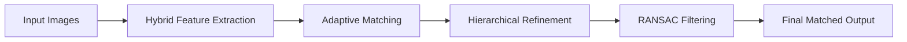

# 🔍 Image Matching System — Hybrid Deep Learning Pipeline

# 🔍 Image Matching System — Hybrid Deep Learning Pipeline

[](https://image-matching-system.streamlit.app)

<p align="center">
  <b>Advanced Computer Vision Project for Feature Matching & Geometric Verification</b><br>
  <i>Inspired by SuperPoint · SuperGlue · LightGlue</i>
</p>
---

## 📌 Overview

This project implements a **multi-stage hybrid image matching pipeline** that detects and matches keypoints between two images with high accuracy.

It combines **classical computer vision + deep learning-inspired techniques** to achieve:

* ⚡ Fast performance on CPU
* 🎯 High-quality feature matching
* 🔍 Robustness to scale, rotation, and viewpoint changes

---

## 🧠 Pipeline Architecture



---

## ⚙️ Core Components

### 🔹 1. Hybrid Feature Extraction

* **SIFT** → robust descriptors (simulating SuperPoint)
* **ORB** → fast dense keypoints (simulating DISK)
* Fusion → best of both worlds

---

### 🔹 2. Adaptive Attention Matching

* Brute-force matching + Lowe’s Ratio Test
* Simulated **attention mechanism**
* **Early exit strategy** for speed optimization

---

### 🔹 3. Hierarchical Refinement

* Multi-scale matching:

  * 0.25x → coarse
  * 0.5x → refine
  * 1x → final

---

### 🔹 4. RANSAC Filtering

* Removes incorrect matches
* Keeps only **geometrically consistent matches**

---

## 🎯 Features

* ✅ Hybrid feature extraction (SIFT + ORB)
* ✅ Adaptive matching with confidence control
* ✅ Multi-scale refinement pipeline
* ✅ RANSAC-based outlier removal
* ✅ Beautiful Streamlit UI
* ✅ Real-time visualization of matches
* ✅ Downloadable results

---

## 🖥️ Demo Output

| Input Images | Matched Output                   |
| ------------ | -------------------------------- |
| 📷 Image 1   | 🟢 Correct matches (green lines) |
| 📷 Image 2   | 🔴 Incorrect matches removed     |

---

## ⚙️ Tech Stack

* **Python**
* **OpenCV**
* **NumPy**
* **Streamlit**

---

## 🚀 Installation & Setup

### 1️⃣ Clone Repository

```bash
git clone https://github.com/ram-ogra/image-matching-system.git
cd image-matching-system
```

---

### 2️⃣ Create Virtual Environment

```bash
python -m venv venv
source venv/Scripts/activate
```

---

### 3️⃣ Install Dependencies

```bash
pip install -r requirements.txt
```

---

### 4️⃣ Run Application

```bash
python -m streamlit run app.py
```

---

## 🌍 Deployment

This project can be deployed using:

* 🔹 Streamlit Cloud (recommended)
* 🔹 Render

---

## ⚡ Performance Optimization (CPU Friendly)

| Mode         | Keypoints | Time    |
| ------------ | --------- | ------- |
| Fast         | 500       | ~2 sec  |
| Balanced     | 1000      | ~5 sec  |
| High Quality | 2000      | ~10 sec |

---

## 📚 Concepts Covered

* Feature Detection (SIFT, ORB)
* Descriptor Matching
* Lowe’s Ratio Test
* RANSAC
* Multi-scale Image Processing
* Computer Vision Geometry

---

## 👨‍💻 Author

**Ramswroop Ogra**
🎓 IIIT Sonepat
💻 B.Tech IT

---

## ⭐ Support

If you found this project helpful:

👉 Give it a ⭐ on GitHub
👉 Share with others

---

## 📌 Future Improvements

* Deep learning integration (SuperPoint, LightGlue)
* GPU acceleration
* Real-time video matching
* 3D reconstruction support

---
